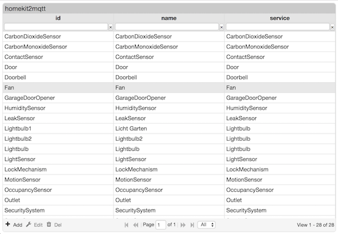
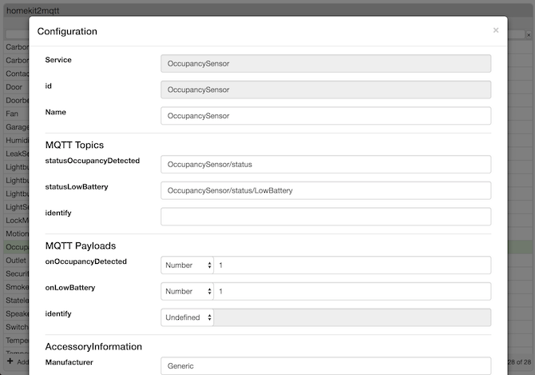

# homekit2mqtt 

[](http://badge.fury.io/js/homekit2mqtt)
[](https://gemnasium.com/github.com/hobbyquaker/homekit2mqtt)
[](https://travis-ci.org/hobbyquaker/homekit2mqtt)
[](https://coveralls.io/github/hobbyquaker/homekit2mqtt?branch=master)
[](https://github.com/sindresorhus/xo)
[![License][mit-badge]][mit-url]

HomeKit to MQTT bridge 🏡📱

> Depends on [HAP-NodeJS](https://github.com/KhaosT/HAP-NodeJS) by [KhaosT](https://github.com/KhaosT), all credits belong to him.

This project follows the [mqtt-smarthome architecture](https://github.com/mqtt-smarthome).
I'm using this to control a multitude of MQTT-connected "Things" in my home automation through Siri and with HomeKit apps.

## Installation

**Prerequisites:** 

 * Debian, Ubuntu, Raspbian or macOS
 * [Node.js](https://nodejs.org) 6 or higher
 * If you're running on Linux, you'll need to make sure you have the libavahi-compat-libdnssd-dev package installed:
   `sudo apt-get install libavahi-compat-libdnssd-dev`


`sudo npm install -g homekit2mqtt --unsafe-perm`   

## Command Line Options

<pre>
Usage: homekit2mqtt [options]

Options:
  -v, --verbosity    possible values: "error", "warn", "info", "debug"
                                                               [default: "info"]
  -m, --mapfile      JSON file containing HomeKit Services to MQTT mapping
                     definitions. See Readme.                          [default:
         "/Users/basti/WebstormProjects/homekit2mqtt/example-homekit2mqtt.json"]
  -n, --name         instance name. used as mqtt client id and as prefix for
                     connected topic                        [default: "homekit"]
  -u, --url          mqtt broker url. See
                     https://github.com/mqttjs/MQTT.js/wiki/mqtt
                                                   [default: "mqtt://127.0.0.1"]
  -s, --storagedir   directory to store homekit data
  -p, --port         port homekit2mqtt is listening on          [default: 51826]
  -w, --web-port     port webserver is listening on             [default: 51888]
  -x, --disable-web  disable webserver
  -h, --help         Show help                                         [boolean]
  --version          Show version number                               [boolean]
  -c, --pincode                                          [default: "031-45-154"]
  -a, --username                                  [default: "CC:22:3D:E3:CE:F6"]
  -b, --bridgename                                      [default: "MQTT Bridge"]
                                                                 
</pre>

## Configuration

homekit2mqtt needs a JSON file that defines devices and mappings from MQTT-topics and payloads to 
HomeKit-characteristics. You can either create this manually or use the Web UI to configure homekit2mqtt. The Webserver
listens on Port 51888 by default, authentication username is `homekit` and the password is the pincode (`031-45-154` by
default).




See [example-homekit2mqtt.json](example-homekit2mqtt.json) for an example configuration. Every Accessory is represented 
like this in the JSON file:

```javascript
  "TemperatureSensor": {                                    // Unique Name - used to generate the accessory UUID
    "service": "TemperatureSensor",                         // HomeKit Service Type (see below)
    "name": "TemperatureSensor",                            // Display Name
    "topic": {                                              
        // ... MQTT Topic Configuration ...
    },
    "payload": {
        // ... MQTT Payload Configuration ...
    },
    "manufacturer": "Generic",                              // Additional Accessory Infos (optional)
    "model": "TemperatureSensor"                            // Additional Accessory Infos (optional)
  }
```
## Available Service Types
